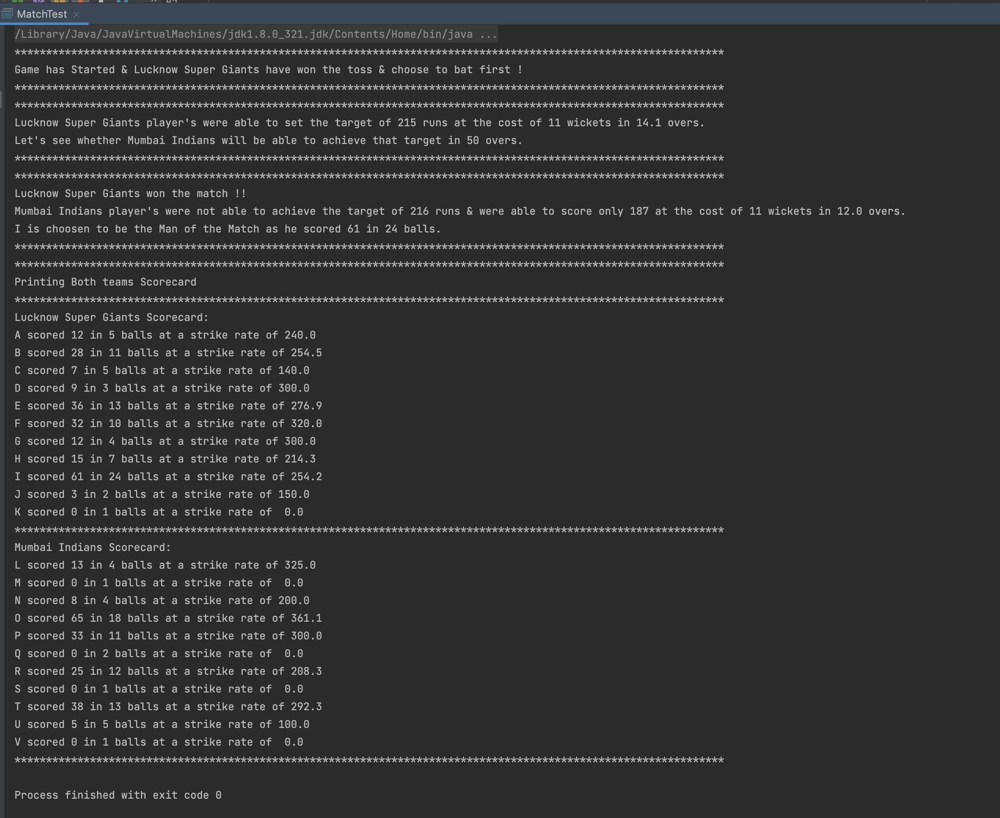

# Cricket Game

### Class Diagram

I have created 4 necessary classes
- Player
- Team
- Match
- MatchController

I have created a class `MatchTest` in `com.cricketgame.test` package to test all the 3 models.

### Sample Output

I have hardcoded the team names for now.

    